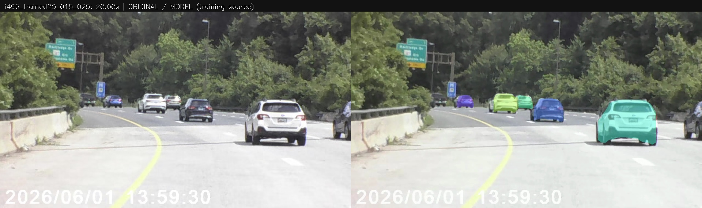
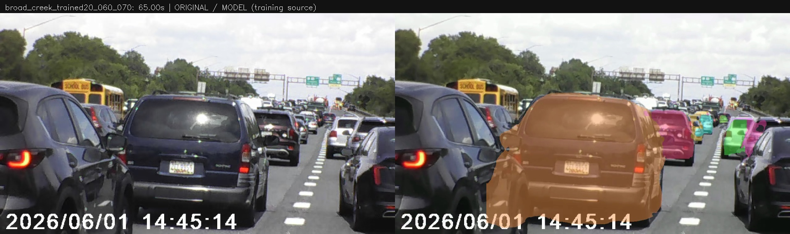

# JALO

運転動画に映る乗用車・トラック・バスを見つけ、**車体の予測輪郭に半透明の色を重ねる**Pythonの研究プロジェクトです。車両の追跡IDごとに色をそろえ、検出枠は表示しません。

現在は予備学習の段階です。無料の運転動画から作成した参照注釈で追加学習し、車両ごとの局所マスクを出せることを確認しました。**未学習動画での実用的な認識品質は、まだ確認できていません。**

リポジトリとReleaseは非公開です。以下のリンクを開くには、アクセス権のあるGitHubアカウントでサインインしてください。

## 結果とモデル

[予備学習モデル・結果動画・確認記録をダウンロード](https://github.com/james-yusuke/jalo/releases/tag/v0.2.0-alpha.2)

`v0.1.1`のCOCO学習済み重みを継承し、車両の位置を推定する層、車両ごとの局所マスク層、道路などの背景を区別する層を追加学習しました。外部の検出・セグメンテーションモデルの重みは使用していません。





[高速道路の10秒動画](https://github.com/james-yusuke/jalo/releases/download/v0.2.0-alpha.2/i495_trained20_015_025.mp4)・[混雑場面の10秒動画](https://github.com/james-yusuke/jalo/releases/download/v0.2.0-alpha.2/broad_creek_trained20_060_070.mp4)

車体に沿って色が付く例が増えましたが、車両の見逃し、一台が複数色に分かれる例、隣の車両へのはみ出しが残っています。

上の画像・動画は**学習に使用した動画での動作確認**です。抽出した学習画像の間のフレームも含みますが、動画自体が学習用なので、未知の道路への認識性能を示すものではありません。推論には映像だけを渡しており、参照注釈や正解矩形で出力を修正していません。

### 以前のモデルとの違い

以前の`v0.1.1`はCOCOだけで学習したモデルです。I-495の3区間を初めて処理した際は、見逃しや、複数の車両と道路をまとめて塗る失敗がありました。


[以前の結果動画とモデル](https://github.com/james-yusuke/jalo/releases/tag/v0.1.1)は保持しています。I-495は今回から学習用に使用しているため、新モデルの未学習評価には使いません。

## 使っている無料の運転動画

動画単位で用途を分離しています。作者・ライセンス・取得元・ファイルのハッシュと抽出時刻はReleaseの記録にも保存しています。

| 用途 | 動画（元の配布ページ） | 作者・ライセンス | 計画した参照画像 |
|---|---|---|---:|
| 学習 | [I-495](https://commons.wikimedia.org/wiki/File:Driving_eastbound_on_I-495_from_the_I-270_Spur_to_Cedar_Lane_(1_June_2026).webm) | Illegitimate Barrister・CC BY-SA 4.0 | 95枚 |
| 学習 | [Broad Creek → Jennifer Road](https://commons.wikimedia.org/wiki/File:Driving_from_Broad_Creek_to_Jennifer_Road_in_Annapolis,_Maryland_(1_June_2026).webm) | Illegitimate Barrister・CC BY-SA 4.0 | 95枚 |
| 検証・しきい値選択 | [Leaman Farm Road → Game Preserve Road](https://commons.wikimedia.org/wiki/File:Driving_from_Leaman_Farm_Road_to_Game_Preserve_Road_in_Gaithersburg,_Maryland_(1_June_2026).webm) | Illegitimate Barrister・CC BY-SA 4.0 | 95枚 |
| 未学習の最終評価 | [原州市の運転動画](https://commons.wikimedia.org/wiki/File:2020-04-16_원주시_도로주행.webm) | Choi Kwang-mo・[CC0 1.0](https://creativecommons.org/publicdomain/zero/1.0/) | 55枚 |

各ページの「Original file」から無料で取得できます。米国の3動画は15秒から300秒未満、原州市は15秒から180秒未満を3秒間隔で抽出しています。
[CC BY-SA 4.0](https://creativecommons.org/licenses/by-sa/4.0/)の動画は、再利用時に作者・元動画・ライセンス・変更点の表示などが必要です。
掲載した結果映像・比較画像・参照注釈もCC BY-SA 4.0で提供します。フレーム抽出、AIによる輪郭注釈、予測色、比較用の配置・説明を加えています。

著作権を懸念された日本の右折動画と、その動画で追加学習した重みは、今回の学習・配布モデルに使用していません。

## 学習データと確認できた範囲

追加学習に使った動画の参照注釈は、I-495の12枚とBroad Creekの8枚、合計**20枚・156台分**です。内訳はcar 138、truck 17、bus 1です。バンはcarに含めます。
輪郭はAIが原画像から作成し、原画像と注釈の重畳表示を全20枚で確認しました。**独立した人手検証を受けた正解データではありません。** 判別できない車両はignore領域にし、道路や建物は背景として扱います。

既存のCOCO 2017公式trainの2,000枚（車両あり1,800枚／なし200枚）も継続して使用し、通常の追加学習ではCOCOと動画画像を1対1で混ぜています。少数画像への過学習確認だけは、動画の学習画像8枚で行いました。

以下は**学習に使った20枚での診断**です。ByteTrackを適用する前の予測であり、検証・最終評価の合格を示す数値ではありません。

| 学習画像での診断 | 結果 |
|---|---:|
| 着色画素のPrecision | 98.39% |
| 長辺32px以上・同一クラス・マスクIoU 0.5でのRecall | 97.44%（152 / 156台） |
| 背景への誤着色率 | 0.202%（32,421 / 16,060,574画素） |
| carの対応数 | 135 / 138台 |
| truckの対応数 | 16 / 17台 |
| busの対応数 | 1 / 1台 |
| 長辺32px未満・車内の評価 | 対象なし／欠測 |
| 未学習動画のAP・実用性判定 | 未実施 |

予備学習は8枚版の1,500更新を引き継ぎ、20枚版で1,592更新、合計3,092更新です。パラメータ数は15,156,129。FP32／MPSで学習し、マスク層の有限な勾配、保存・再開、推論用モデルの重みと出力の一致を確認しました。

10秒・300フレームの動画処理時間は、I-495が94.45秒、Broad Creekが129.00秒でした。いずれも1280×720・30fpsで保存し、全フレームの再読込、JSONLの時刻・RLE・色の対応、H.264／yuv420p／faststartを確認しました。この2本の元動画に音声はありません。

340枚の画像抽出は完了しています。Release作成時点で参照注釈は131枚を確認済みです（学習用36枚、検証用95枚）。検証用95枚・456台分は予測を見る前に保存しました。残る学習用154枚と最終評価用55枚の注釈は作成中です。36枚版の追加学習も別のrunで進めていますが、このReleaseの配布モデルと上の結果は完了済みの20枚版です。先に確認済みの学習画像で予備学習を進める順序に変更しました。検証用と最終評価用の動画を学習には混ぜていません。
この予備モデルは検証によるモデル選択・しきい値調整を行っていません。クラスしきい値0.3、局所マスクと車両前景のしきい値0.5、透明度45%を初期値として使用しています。

実用性の判定には、未学習の検証・最終評価動画で、着色画素Precision 90%以上、長辺32px以上の車両Recall 80%以上、背景・車内への誤着色率0.5%以下をすべて満たす必要があります。何も塗らない結果は不合格です。最終評価の対象車両が100件未満なら判定を保留します。
**この判定と最終評価動画の全編出力は未完了です。** 予備モデルからは短い確認動画を書き出せますが、合格したモデルとして全編出力することはできません。

## 自分の動画で試す

### 1. ダウンロードする

- [ソースコードのZIP](https://github.com/james-yusuke/jalo/archive/refs/tags/v0.2.0-alpha.2.zip)を保存して展開します。
- [予備学習済みモデル](https://github.com/james-yusuke/jalo/releases/download/v0.2.0-alpha.2/jalo-local-vehicles-preliminary.pt)を保存します。展開したフォルダの中に`checkpoints`フォルダを作り、その中に置きます。
- 処理する動画を同じフォルダに置きます。次の例では`demo.webm`とします。自分のMP4などの名前にも読み替えられます。

推論にはこのモデルファイルだけを使います。学習用の画像やローカル注釈フォルダは必要ありません。

### 2. 実行環境を用意する

[Python 3.11以上](https://www.python.org/downloads/)と[FFmpeg](https://ffmpeg.org/download.html)が必要です。FFmpegは`libx264`を含むものを使い、`ffmpeg`と`ffprobe`を実行できるようにします。ソースを展開したフォルダでターミナルを開きます。

```bash
python -m venv .venv
```

macOS／Linuxは`source .venv/bin/activate`、Windows PowerShellは`.venv\Scripts\Activate.ps1`で仮想環境を有効にします。`python`が見つからない場合は`python3`に読み替えてください。

```bash
python -m pip install .
python -m jalo doctor
```

### 3. 短い動画を書き出す

```bash
python -m jalo demo --input demo.webm --checkpoint checkpoints/jalo-local-vehicles-preliminary.pt --render masks --duration 20 --output outputs/demo_masks.mp4 --device auto --no-preview
```

`outputs/demo_masks.mp4`を開いて再生します。映像はH.264／yuv420p／faststartのMP4で保存し、元音声があればAACで残します。同名のJSONLにフレーム時刻・クラス・信頼度・追跡ID・マスクRLEも保存します。

モデルに保存した入力544×960としきい値を既定で使います。車両の矩形を塗り潰す処理や、マスクがない車両を枠で代用する処理はありません。ByteTrackによるIDごとの色を使用し、クエリ番号を追跡IDにはしません。

`--no-preview`を外すと処理中の映像を表示できます。Spaceで一時停止、Q／Escで終了します。
`--device auto`はCUDA → MPS → CPUの順に選びます。Mac／MPSで学習・勾配・再開・動画保存を確認しました。CUDAはコードと分岐テストのみで、実機では未検証です。

## モデルの構成と再現

ImageNet学習済みResNet-18の特徴から、中心位置と初期矩形を予測し、位置付きクエリを作ります。192次元・6ヘッド・3層のAttentionが周辺の画像特徴を参照して位置と分類を補正します。各車両の周辺特徴を28×28で取り出し、共有の畳み込み層から56×56の輪郭を出します。

ピクセル特徴、Attention、正規化、FFN、分類などを`v0.1.1`から継承しました。絶対座標の矩形出力を補正量に流用せず、最初の移植では補正出力をゼロに初期化しています。以後の注釈追加では、学習済みの局所マスクと矩形補正も含めて継承します。対応する名前・形状・役割、初期化した層はReleaseの移植記録に保存しています。

<details>
<summary>学習と評価の実行手順</summary>

Releaseには設定、参照注釈、データ選択、乱数・optimizer・scheduler・データ順を含む再開用チェックポイント、共有の学習時間記録を添付しています。元動画とCOCOは各配布元から取得します。配布モデルが使用した20枚の注釈と、途中まで確認した36枚の学習用注釈・95枚の検証用注釈を、版を分けて保存しています。340枚の完成した評価データセットではありません。

最初の8枚版を準備・学習する例です。入力ファイルの配置はReleaseの `reproduction_bundle.zip` 内の案内に記載しています。

```bash
python -m jalo prepare --dataset video-instances --root data/free_driving_adapt --sources data/free_driving_adapt/sources.json --annotations data/free_driving_adapt/preliminary_annotations.json --preliminary
python -m jalo train --config configs/free_driving_preliminary.yaml --initialize checkpoints/jalo-coco-vehicles.pt --device mps
```

20枚版へ移る場合は、別のmanifest名とrunフォルダを使います。

```bash
python -m jalo prepare --dataset video-instances --root data/free_driving_adapt --sources data/free_driving_adapt/sources.json --annotations data/free_driving_adapt/preliminary_annotations_r4.json --preliminary --manifest-name preliminary_manifest_r4.json
python -m jalo train --config configs/free_driving_preliminary_expanded.yaml --initialize runs/free_driving_adapt/preliminary/last.pt --device mps
```

少数画像への過学習確認では、損失だけでなく出力マスクの目視確認も必要です。再開用ファイルには、その確認記録も含めています。`--initialize`は学習済み重みを引き継いで新しい実験を始め、optimizerとデータ順を初期化します。`--resume`は同じ注釈・分割・設定の状態を完全に復元するために使います。注釈の版を変えた再開や、学習時間のリセットは拒否します。

全参照注釈がそろった段階で、`configs/free_driving_adapt.yaml`による検証・しきい値選択と、一度だけの最終比較を行います。予備チェックポイントには評価未完了の識別情報を保存しており、最終評価済みのモデルとして扱うことはできません。

AdamW、独自層`1e-4`・バックボーン`1e-5`、weight decay `1e-4`、FP32、バッチ1・勾配累積4、勾配クリップ0.1を使用します。BatchNormの統計は固定します。共有の上限は学習・評価合計8時間／50,000更新です。

旧モデルのCOCO公式val 300枚での計測値は矩形AP 1.03%、マスクAP 4.66%でした。これは`v0.1.1`・入力384×640・1,500更新の値で、今回の局所マスクモデルや運転動画の成績ではありません。[以前の設定と評価記録](https://github.com/james-yusuke/jalo/releases/tag/v0.1.1)を保持しています。

時間Attention比較用の`single`／`temporal`／`gated`とBDD100K用の設定も保持しています。今回の追加学習は単一フレーム版だけです。BDD100Kの実データ比較は未実施で、YOLOへの優位性や学術的新規性は主張しません。

</details>

## ライセンス

ソースコードは[MIT License](LICENSE)です。掲載した運転動画の加工結果・比較画像・参照注釈は前述のCC BY-SA 4.0で提供します。外部データ・事前学習済み重みは各提供元の条件を参照してください。[COCOの利用条件](https://cocodataset.org/#termsofuse)も確認してください。

`scripts/`・`docs/`・学習データ・モデルの重みはGitに含めません。モデルと結果はタグ付きReleaseに添付し、既存のモデルとReleaseも保持しています。
