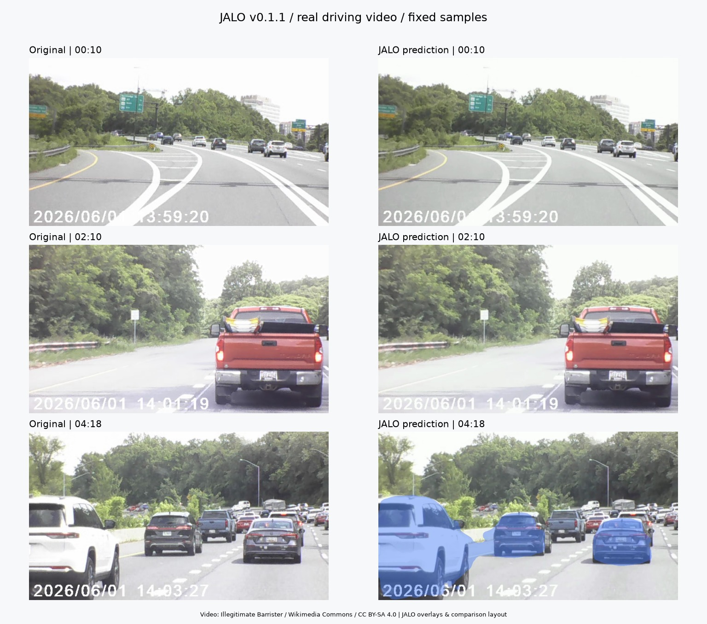

# JALO

運転動画に映る車両を見つけ、車体の予測マスクに半透明の色を重ねるPythonの研究プロジェクトです。
対象は乗用車・トラック・バス。色は追跡IDごとにそろえ、検出枠は表示しません。

**現在のモデルは試作段階です。見逃しや背景への誤着色があり、実用的な認識品質には達していません。**
以下に、無料で利用できる実際の運転動画での結果を掲載しています。

## まず結果を見る

[評価動画とモデルをダウンロード](https://github.com/james-yusuke/jalo/releases/tag/v0.1.1)

同じ配布モデルを使い、学習に使用していない運転動画の3区間を処理しました。
**評価結果：車両を安定して認識・分離できていません。** 近くの車両でも未着色になり、着色された場面では車間の道路まで塗る例がありました。



左が元映像、右が予測です。事前に固定した9時刻を目視確認し、0:10・2:10の未着色例と4:18の誤着色例を掲載しています。
4:18では、ひとつのマスクが複数の車両と車間の背景をまとめて塗っています。予測マスクを手で修正する処理は行っていません。

| 元動画の区間 | 結果動画（各20秒） | 着色が発生したフレーム |
|---|---|---:|
| 0:00–0:20 | [MP4を見る・保存する](https://github.com/james-yusuke/jalo/releases/download/v0.1.1/i495_masks_000_020.mp4) | 3 / 600 |
| 2:00–2:20 | [MP4を見る・保存する](https://github.com/james-yusuke/jalo/releases/download/v0.1.1/i495_masks_120_140.mp4) | 0 / 600 |
| 4:00–4:20 | [MP4を見る・保存する](https://github.com/james-yusuke/jalo/releases/download/v0.1.1/i495_masks_240_260.mp4) | 213 / 600 |

「着色が発生した」は、正しく認識できたという意味ではありません。ダウンロードが始まった場合は、保存したMP4を動画プレーヤーで開いてください。

合計60秒・1,800フレーム、出力1280×720／30fps／H.264、音声なしです。
Mac／MPS、入力384×640、クラスしきい値0.3、マスクしきい値0.5、背景候補の除外あり、色の濃さ45%で評価しました。
元動画のフレーム間隔が一定ではないため、映像の時刻を保ちながら30fpsへそろえて処理しています。
全出力フレームの再読込、再生時間、記録された時刻との対応を確認しました。
詳細な記録・9時刻の比較画像・フレームごとの予測は[Releaseの添付ファイル](https://github.com/james-yusuke/jalo/releases/tag/v0.1.1)から取得できます。


この動画に正解の車両マスクはありません。上の結果は動作と着色の目視評価であり、認識精度のAPやRecallを示すものではありません。
動画を学習・モデル選択・しきい値調整には使っていません。

## 使用した無料の運転動画

[Driving eastbound on I-495 from the I-270 Spur to Cedar Lane (1 June 2026)](https://commons.wikimedia.org/wiki/File:Driving_eastbound_on_I-495_from_the_I-270_Spur_to_Cedar_Lane_(1_June_2026).webm)

作者：**Illegitimate Barrister**。ライセンス：**[CC BY-SA 4.0](https://creativecommons.org/licenses/by-sa/4.0/)**。
元動画は約5分、1280×720、音声なしです。上のリンクの「Original file」から無料で取得できます。

掲載した結果動画と比較画像は、この映像の一部を抽出し、JALOの予測色・比較用の配置や説明を加えたものです。
これらの映像・画像も**CC BY-SA 4.0**で提供します。再利用する場合は、作者・元動画・ライセンスを表示し、変更点を明記してください。
無料利用にはこの条件があり、著作権が放棄された動画ではありません。

## 自分の動画で試す

### 1. ファイルをダウンロードする

- [ソースコードをZIPでダウンロード](https://github.com/james-yusuke/jalo/archive/refs/tags/v0.1.1.zip)して展開します。
- [学習済みモデルをダウンロード（約60 MB）](https://github.com/james-yusuke/jalo/releases/download/v0.1.1/jalo-coco-vehicles.pt)します。展開したフォルダに`checkpoints`フォルダを作り、その中に置きます。
- 処理したい動画を同じフォルダに置き、以下の例では`demo.webm`という名前にします。自分のMP4などの名前に読み替えても構いません。

### 2. 実行環境を用意する

[Python 3.11以上](https://www.python.org/downloads/)と[FFmpeg](https://ffmpeg.org/download.html)が必要です。FFmpegは`libx264`を含むものを使い、`ffmpeg`と`ffprobe`を実行できるようにしてください。
ソースを展開したフォルダでターミナルを開き、次を実行します。

```bash
python -m venv .venv
```

macOS／Linuxでは`source .venv/bin/activate`、Windows PowerShellでは`.venv\Scripts\Activate.ps1`で仮想環境を有効にします。
macOSなどで`python`が見つからない場合は、`python3`に読み替えてください。

```bash
python -m pip install .
python -m jalo doctor
```

### 3. 動画を処理する

まず20秒間を処理する例です。

```bash
python -m jalo demo --input demo.webm --checkpoint checkpoints/jalo-coco-vehicles.pt --render masks --foreground-only --duration 20 --output outputs/demo_masks.mp4 --device auto --no-preview
```

`outputs/demo_masks.mp4`を開くと結果を再生できます。全編を処理する場合は`--duration 20`を外します。
映像はH.264のMP4で保存し、元の音声があればAACで残します。色の濃さは45%です。
`--no-preview`を外すと処理中に表示できます。Spaceで一時停止、Q／Escで終了します。
同名のJSONLにはフレーム時刻、クラス、信頼度、追跡ID、予測マスクも保存します。

`--device auto`は利用できるGPUを選びます（CUDA → MacのMPS → CPU）。Mac／MPSで動作確認済み、CUDAは実機未検証です。

## モデルと学習データ

ImageNetで学習済みのResNet-18を特徴抽出に使用し、Attention、分類、矩形、マスクの各ヘッドをPyTorchで実装しています。
既存の検出・セグメンテーションモデルの重みは使用していません。

配布モデルはCOCO 2017公式trainから選んだ2,000枚（車両あり1,800枚／なし200枚）で学習した単一フレーム版です。
公式valの別の300枚でモデルを選択しました。運転動画での追加学習は含みません。
`v0.1.1`の重みは`v0.1.0`と同じで、今回の更新は動画の時刻処理の修正、運転動画での評価、案内の改善です。

| COCO検証画像300枚での指標 | 結果 |
|---|---:|
| 矩形AP | 1.03% |
| マスクAP | 4.66% |

これは1,500更新時点・入力384×640のCOCO形式APです。上の運転動画に対する精度ではありません。
学習設定、画像ID、評価値、ファイルの照合用ハッシュは[Release](https://github.com/james-yusuke/jalo/releases/tag/v0.1.1)に添付しています。
配布モデルは推論用で、学習状態の完全再開に必要なoptimizer等は含みません。

<details>
<summary>学習・研究用のコマンド</summary>

```bash
python -m jalo prepare --dataset coco-instances --root data/coco_vehicle
python -m jalo train --config configs/vehicle_masks.yaml --variant single --run-dir runs/coco_new --device auto
python -m jalo evaluate --checkpoint checkpoints/jalo-coco-vehicles.pt --config configs/vehicle_masks.yaml --split val --device auto
python -m jalo export --checkpoint runs/coco_new/best.pt --output checkpoints/my-model.pt
```

Releaseの`training_config.yaml`が元の学習設定です。リポジトリの設定は新規実験用に上限を10,000更新／3時間にしています。
時間Attentionの比較用に`single`／`temporal`／`gated`と`configs/mac_small.yaml`／`configs/full.yaml`も含みます。
BDD100Kでの実データ比較は未実施です。独自実装と学術的な新規性は別であり、YOLOに対する優位性を主張しません。

</details>

## ライセンス

ソースコードは[MIT License](LICENSE)です。掲載した運転動画の加工結果・比較画像は前述のCC BY-SA 4.0です。
データと外部の事前学習済み重みは各提供元の条件を参照してください。[COCOの利用条件](https://cocodataset.org/#termsofuse)も確認してください。
学習データ・元動画・モデルの重み・`scripts/`・`docs/`はGitに含めず、配布モデルと結果動画はReleaseに置いています。
