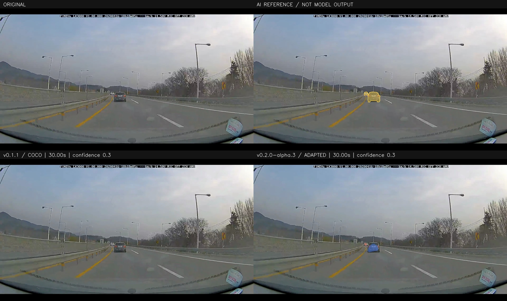
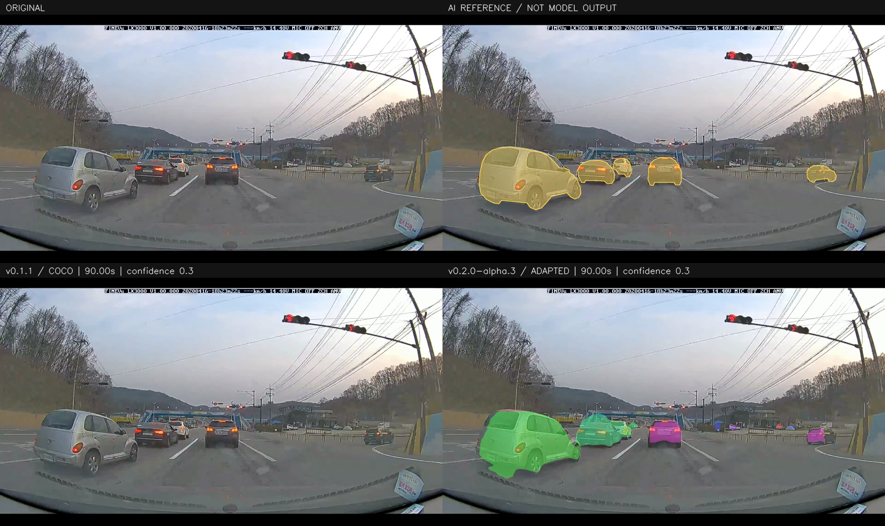
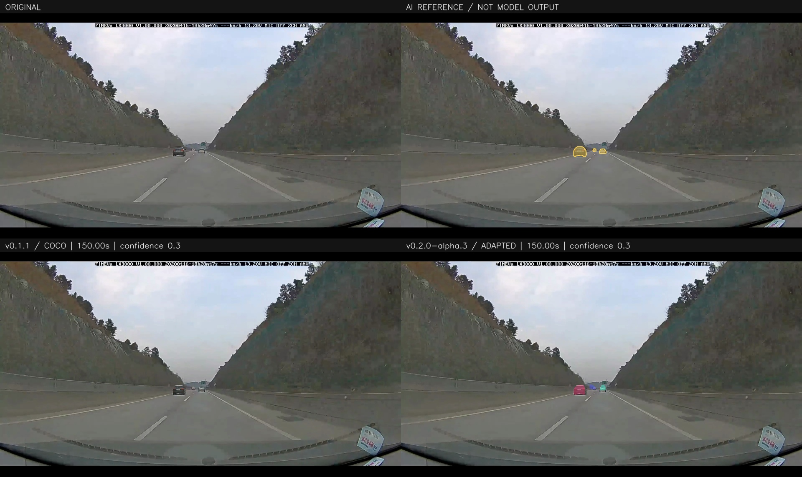

# JALO

現在の車両輪郭モデルを、今後の改良の基準となる **v0.1.0** として配布します。旧系列のタグ・Releaseは整理し、バージョン番号を再スタートしました。今回の変更は配布と採番の整理で、重み・評価値は直前の改善版と同一です。

運転動画の乗用車・トラック・バスを認識し、**見えている車体の予測輪郭に半透明の色を重ねる**Pythonの研究プロジェクトです。車両の追跡IDごとに色をそろえ、検出枠は表示しません。

**実用的な認識品質には、まだ達していません。** COCOで学習した旧試作モデルから無料の運転動画で追加学習し、未学習動画で比較評価しましたが、設定した合格条件を満たせませんでした。結果と失敗例を含む研究版として配布します。

[モデルをHugging Faceから取得](https://huggingface.co/james-yusuke/jalo)・[結果動画・参照注釈・再開用状態をGitHub Releaseから取得](https://github.com/james-yusuke/jalo/releases/tag/v0.1.0)

Hugging Faceには推論モデルとモデルカードを置き、ソースコードはこのGitHubリポジトリで配布します。

## 未学習の運転動画での結果

韓国・原州市の無料動画で、COCOだけで学習した旧試作モデル（旧採番`v0.1.1`）と、現在の配布モデルを比較しました。この動画は学習・モデル選択・しきい値調整に使用していません。



[20–40秒の比較動画](https://github.com/james-yusuke/jalo/releases/download/v0.1.0/wonju_020_040_comparison.mp4)・[80–100秒](https://github.com/james-yusuke/jalo/releases/download/v0.1.0/wonju_080_100_comparison.mp4)・[140–160秒](https://github.com/james-yusuke/jalo/releases/download/v0.1.0/wonju_140_160_comparison.mp4)

近距離の車両では、後ろ姿・正面ともに車体の形に沿う着色を確認しました。一方、車体の塗り残し、下端から路面へのはみ出し、同じ車両が複数色になる場面、遠方車両の見逃し・着色の途切れが残ります。旧モデルは、この3本の短いプレビューでは着色がありませんでした。目視確認は各区間を1秒間隔で抽出した比較画像と固定時刻の拡大比較に基づき、全フレームの目視確認ではありません。

<details>
<summary>90秒・150秒の比較画像と確認用サンプル</summary>





各図は左上が原映像、右上がAI参照注釈、左下が旧モデル、右下が現在の配布モデルです。比較画像・動画の`v0.1.1`表記は、過去の比較対象の旧採番です。参照注釈を使って推論結果を補正していません。[1秒間隔の比較画像一式](https://github.com/james-yusuke/jalo/releases/download/v0.1.0/preview_review_samples.zip)には、未着色や複数色になった場面も含めています。

</details>

### 参照注釈に基づく測定

以下は**ByteTrackを含む実際の着色処理**の値です。追跡は各元動画の先頭から全フレームで更新し、3秒間隔の参照画像で測定しています。車両のRecallは同一クラス・マスクIoU 0.5・一対一対応です。

| データ | モデル | 着色画素Precision | 車両Recall（長辺32px以上） | 背景への誤着色 | 車内への誤着色 | 合格 |
|---|---|---:|---:|---:|---:|---|
| 検証 | 旧COCO試作 | 48.1% | 0.0%（0/446） | 0.386% | 対象なし／欠測 | 未達 |
| 検証 | 改善版 | 96.5% | 63.2%（282/446） | 0.450% | 対象なし／欠測 | 未達 |
| 最終評価 | 旧COCO試作 | 算出不可（着色なし） | 0.0%（0/144） | 0.000% | 0.000% | 未達 |
| 最終評価 | 改善版 | 94.1% | 75.7%（109/144） | 0.171% | 0.017% | 未達 |

| データ | モデル | 矩形AP / AP50 | マスクAP / AP50 | 入力 |
|---|---|---:|---:|---|
| 検証 | 旧COCO試作 | 0.02% / 0.08% | 0.15% / 0.50% | 384×640 |
| 検証 | 改善版 | 15.22% / 29.99% | 14.76% / 28.45% | 544×960 |
| 最終評価 | 旧COCO試作 | 0.00% / 0.02% | 0.08% / 0.25% | 384×640 |
| 最終評価 | 改善版 | 31.26% / 68.70% | 30.64% / 66.21% | 544×960 |

APは追跡前の全クエリによるCOCO方式の値で、着色しきい値による候補除外の前に計測します。着色後の値とは対象と定義が異なります。小物体AP、サイズ別・クラス別のRecallと対象数、しきい値ごとの検証結果はReleaseの`comparison_metrics.csv`とJSONにあります。対象のない指標は欠測です。

最終評価は55枚、ignore領域を除いた対象は長辺32px以上が144件、32px未満が19件です。検証で選んだクラスしきい値は旧モデル0.3、改善版0.3です。両モデルのマスクしきい値は0.5、透明度は45%です。改善版は車両前景の予測にも0.5を適用します。

合格条件は、着色画素Precision 90%以上、長辺32px以上の車両Recall 80%以上、背景・車内への誤着色率0.5%以下です。追跡前と実際の描画の両方で、検証・最終評価ともに達成する必要があります。何も着色しない結果は不合格で、最終評価の車両対象が100件未満なら判定を保留します。判定には丸め前の値を使います。

参照注釈は**AIが原画像から作成し、AIが全画像の重畳表示を目視確認したもの**です。独立した人手検証を受けた正解ではありません。件数には同じ車両が異なる時刻に映る例を含みます。原州市の動画には編集・時間圧縮、近い構図が続く区間、終盤のトンネル進入が含まれます。この実験の結果を未知の道路全般の性能とは扱いません。

今回の追加学習・評価は、破棄した試行も含めて合計7時間4分、13,961更新でした。全注釈を使う段階では4,000更新時点のモデルを検証で選択しました。注釈作成・実装・動画書き出しはこの時間に含めていません。

| モデル | 有効パラメータ数 | 20秒×3本の動画処理時間 | 書き出しを含む処理速度 | 観測GPU割当メモリ最大 | プロセスRSS最大 |
|---|---:|---:|---:|---:|---:|
| 旧COCO試作 | 14,308,040 | 59.9秒 | 24.04fps | 0.11GiB | 0.70GiB |
| 改善版 | 15,156,129 | 144.8秒 | 9.95fps | 0.19GiB | 0.74GiB |

同じMac／MPSで各動画を別プロセスで処理しました。パラメータ数は推論で使用する層の合計です。GPUメモリは0.2秒間隔の観測最大値で、厳密なピーク値ではありません。入力解像度も異なるため、構造だけの速度比較ではありません。出力は元の1920×1080・24fpsです。全フレームを再読込し、JSONLの時刻・RLE・追跡IDの色、H.264／yuv420p／faststart、AACの形式・開始時刻・長さを確認しました。対象3区間の元音声は左右とも無音のため、音による同期照合はできていません。

## 使用した無料の運転動画と学習データ

動画単位で用途を分け、合計340枚を注釈しました。バンはcarに含め、判別できない輪郭はignoreとして扱います。車内ラベルは評価用で、描画時の固定除外マスクには使いません。

| 用途 | 動画・配布ページ | 作者・元ライセンス | 参照画像／車両件数 |
|---|---|---|---:|
| 学習 | [I-495](https://commons.wikimedia.org/wiki/File:Driving_eastbound_on_I-495_from_the_I-270_Spur_to_Cedar_Lane_(1_June_2026).webm) | Illegitimate Barrister・CC BY-SA 4.0 | 95枚／814件 |
| 学習 | [Broad Creek → Jennifer Road](https://commons.wikimedia.org/wiki/File:Driving_from_Broad_Creek_to_Jennifer_Road_in_Annapolis,_Maryland_(1_June_2026).webm) | Illegitimate Barrister・CC BY-SA 4.0 | 95枚／718件 |
| 検証・しきい値選択 | [Leaman Farm Road → Game Preserve Road](https://commons.wikimedia.org/wiki/File:Driving_from_Leaman_Farm_Road_to_Game_Preserve_Road_in_Gaithersburg,_Maryland_(1_June_2026).webm) | Illegitimate Barrister・CC BY-SA 4.0 | 95枚／456件 |
| 最終評価 | [原州市の運転動画](https://commons.wikimedia.org/wiki/File:2020-04-16_원주시_도로주행.webm) | Choi Kwang-mo・[CC0 1.0](https://creativecommons.org/publicdomain/zero/1.0/) | 55枚／163件（ignore除外前） |

各ページの「Original file」から無料で取得できます。米国3動画は15–300秒未満、原州市は15–180秒未満を3秒間隔で抽出しました。動画・画像・注釈・分割のハッシュ、抽出時刻と目視確認記録をReleaseに保存しています。[CC BY-SA 4.0](https://creativecommons.org/licenses/by-sa/4.0/)の元動画を再利用するときは、作者・出典・ライセンス・変更点の表示など、その条件に従ってください。

学習用190枚の内訳はcar 1,290件、truck 224件、bus 18件です。既存のCOCO 2017公式trainの2,000枚（車両あり1,800枚・なし200枚、seed 0）と動画画像を1対1で混ぜました。注釈の完成に合わせて8→20→36→126→190枚と段階的に増やしています。少数画像への過学習確認では、学習画像8枚だけを使いました。

著作権を懸念された日本の右折動画と、その動画で追加学習した重みは、今回の学習・配布モデルに使用していません。旧モデルのファイルと実験記録は保全し、配布の基準を今回のv0.1.0へ切り替えました。

## 自分の動画で試す

### 1. ダウンロード

- [ソースコードのZIP](https://github.com/james-yusuke/jalo/archive/refs/tags/v0.1.0.zip)を展開します。
- [Hugging Faceの推論モデル](https://huggingface.co/james-yusuke/jalo/resolve/main/jalo-local-vehicles-evaluated.pt?download=true)（[GitHubからも取得可能](https://github.com/james-yusuke/jalo/releases/download/v0.1.0/jalo-local-vehicles-evaluated.pt)）を保存し、展開したフォルダ内の`checkpoints`フォルダに置きます。
- 入力動画を同じフォルダへ置きます。下の例では`demo.webm`です。自分のMP4などのファイル名に読み替えられます。

推論にはモデルファイルだけを使います。学習画像・参照注釈・ローカルmanifestは不要です。

### 2. 実行環境

[Python 3.11以上](https://www.python.org/downloads/)と[FFmpeg](https://ffmpeg.org/download.html)が必要です。FFmpegは`libx264`を含み、`ffmpeg`と`ffprobe`を実行できるものを使います。ソースを展開したフォルダでターミナルを開きます。

```bash
python -m venv .venv
```

macOS／Linuxは`source .venv/bin/activate`、Windows PowerShellは`.venv\Scripts\Activate.ps1`で有効にします。`python`がない場合は`python3`に読み替えてください。

```bash
python -m pip install .
python -m jalo doctor
```

### 3. 20秒の動画を保存

```bash
python -m jalo demo --input "demo.webm" --checkpoint checkpoints/jalo-local-vehicles-evaluated.pt --render masks --duration 20 --output outputs/demo_masks.mp4 --device auto --no-preview
```

`outputs/demo_masks.mp4`を開いて再生します。H.264／yuv420p／faststartのMP4に保存し、元音声があればAACで残します。同名のJSONLに時刻・クラス・信頼度・追跡ID・マスクRLEを保存します。

保存した入力544×960と検証で選んだしきい値を既定で使います。透明度は45%です。矩形の塗り潰しや、輪郭がない車両を枠で代用する処理はありません。追跡IDにはByteTrackを使い、クエリ番号は使用しません。

`--no-preview`を外すと途中表示ができ、Spaceで一時停止、Q／Escで終了します。`--device auto`はCUDA → MPS → CPUの順に選びます。Mac／MPSで学習・評価・動画保存を確認しました。CUDAはコードと分岐テストのみで、実機未検証です。

**合格前の全編再出力は行っていません。** この版では`--duration`を指定して短い診断動画を書き出します。未達の指標と再開用の学習状態を保存し、最終評価動画を使った再調整は行っていません。

## モデルと再現

ImageNet学習済みResNet-18だけを外部の特徴抽出重みとして使います。検出・セグメンテーションモデルの学習済み重みは流用していません。学習の履歴では、旧COCO試作モデル（旧採番`v0.1.1`）からバックボーン、ピクセル特徴層、Attention、正規化、FFN、分類層を継承しました。

中心ヒートマップと初期矩形から100個の位置付きクエリを作り、192次元・6ヘッド・3層のAttentionで周辺の特徴を参照します。車両ごとに特徴を28×28で取り出し、共有の畳み込み層で56×56の局所マスクを予測します。局所マスクと全体の車両前景予測の両方が成立する画素を着色します。推論に注釈・正解矩形・画像IDは渡しません。

矩形補正の出力は初回移植でゼロ初期化し、旧モデルの絶対座標出力を補正量には流用していません。以後は局所マスクを含む学習済み部分も継承しました。中心からの物体表現や画像由来のクエリには[Objects as Points](https://arxiv.org/abs/1904.07850)、[Conditional DETR V2](https://arxiv.org/abs/2207.08914)などの先行研究があり、独自実装をそのまま学術的新規性とは主張しません。

<details>
<summary>学習設定・評価修正・再現記録</summary>

AdamW、独自層`1e-4`・バックボーン`1e-5`、weight decay `1e-4`、seed 0、FP32、バッチ1・勾配累積4、勾配クリップ0.1を使用し、BatchNormの統計を固定しました。初期入力384×640、統合学習544×960です。250更新ごとに検証・保存し、共有の学習・評価上限を8時間／50,000更新に制限しました。

Releaseには推論モデル、選択した学習状態、最後の再開用状態、設定、340枚の参照注釈、移植・初期化一覧、データ選択、依存バージョン、乱数・optimizer・scheduler・データ順・時間記録を保存しています。別のPCへの配置と再現は添付の`REPRODUCTION_JA.txt`を参照してください。`--initialize`は重みから新しい実験を始め、`--resume`は同じ注釈・分割・設定の状態を復元します。最終評価後にその結果へ合わせた再学習を行うことは拒否します。

離れたignore領域をまとめた外接矩形が、有効領域の偽陽性まで隠す評価の不具合を修正しました。学習状態を保持して旧評価の選択記録を無効化し、以後の測定をやり直しました。掲載値は修正後のものです。97テストが通過し、MPSでの勾配・再開、旧モデル互換、推論用ファイルの一致、参照ZIPの別配置での準備、MP4・JSONLの照合記録も添付しています。MPS再開は保存状態を保持しますが、ビット単位で同一の演算結果は保証しません。

全注釈段階の4,750更新後、局所マスクの損失が切り出し矩形を直接動かす勾配を分離して追加学習しました。重み・optimizer・乱数・データ順を保持し、矩形用の損失は継続しています。検証で選択された配布モデルは変更前の更新時点でした。変更後の最後の状態も再開用に保存しています。この試行だけの効果を分離して証明したものではありません。

検証動画では、予測した切り出し領域の端で車体が欠ける例、同じ車両が複数の候補に分かれる例、バンとトラックの混同が残りました。次の実験の候補は、車両ごとのクエリ特徴をマスクヘッドへ渡す変更、周辺も含むROIで車体全体を学ぶ損失、トラック・バスを含む多様な無料動画と独立した人手による参照確認です。これらは未実装・未検証で、改善を確認したものではありません。新しい計画と未使用の評価動画を用意して検証する必要があります。

次の実験は`configs/vehicle_baseline.yaml`と今回の推論モデルを使い、`--initialize checkpoints/jalo-local-vehicles-evaluated.pt`で開始できます。局所マスク・前景・学習済みの矩形補正を含む全重みを引き継ぎ、optimizerとデータ順は新しくします。新しい注釈を`data/vehicle_baseline`へ準備し、未使用の最終評価動画を用意してください。既存の評価済み実験は凍結したままです。この採番変更では追加学習を実行していません。

時間Attention比較用の`single`／`temporal`／`gated`とBDD100K設定も保持しています。今回の改善は単一フレーム版です。BDD100K実データでの比較、YOLOへの優位性は確認していません。

</details>

## ライセンス

ソースコードは[MIT License](LICENSE)です。掲載した結果動画・比較画像・参照注釈はCC BY-SA 4.0で提供します。元動画の作者・ライセンス・変更内容はReleaseの`MEDIA_LICENSES.txt`にも記録しています。外部データと事前学習済み重みは各提供元の条件、[COCOの利用条件](https://cocodataset.org/#termsofuse)を参照してください。

`scripts/`・`docs/`・学習データ・重みはGitに含めません。現在のモデルと結果をv0.1.0のReleaseに添付しています。旧番号のRelease・タグは置き換え、元のモデルファイルと過去の検証記録は保全しています。
